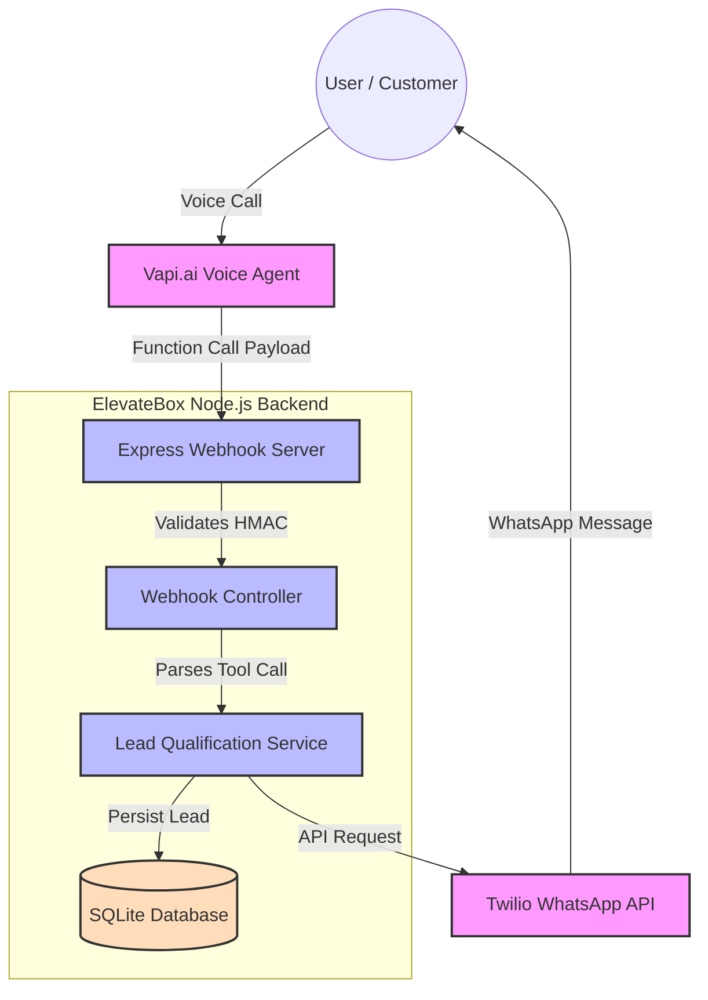

# ElevateBox AI Voice Agent Architecture

```mermaid
graph TD
    %% Core Entities
    User((User / Customer))
    Twilio[Twilio WhatsApp API]
    Vapi[Vapi.ai Voice Agent]
    
    %% Application Layer
    subgraph "ElevateBox Node.js Backend"
        Express[Express Webhook Server]
        Controller[Webhook Controller]
        Service[Lead Qualification Service]
        
        %% Database
        DB[(SQLite Database)]
        
        %% Flow
        Express -->|Validates HMAC| Controller
        Controller -->|Parses Tool Call| Service
        Service -->|Persist Lead| DB
    end

    %% External Connections
    User -- Voice Call --> Vapi
    Vapi -- Function Call Payload --> Express
    Service -- API Request --> Twilio
    Twilio -- WhatsApp Message --> User
    
    %% Styling
    classDef external fill:#f9f,stroke:#333,stroke-width:2px;
    classDef internal fill:#bbf,stroke:#333,stroke-width:2px;
    classDef db fill:#fdb,stroke:#333,stroke-width:2px;
    
    class Twilio,Vapi external;
    class Express,Controller,Service internal;
    class DB db;
```
